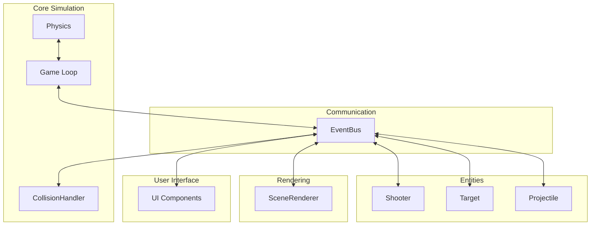
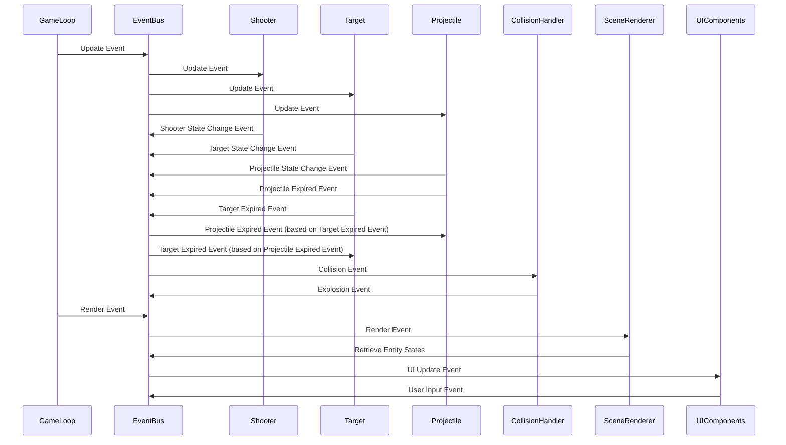

Certainly! Here's an updated version of the diagrams and project structure to reflect the new event-driven architecture:





```
src/
  ├── core/
  │   ├── physics/
  │   │   ├── CollisionDetection.ts
  │   │   └── CollisionHandler.ts
  │   └── GameLoop.ts
  │
  ├── entities/
  │   ├── Shooter.ts
  │   ├── Target.ts
  │   └── Projectile.ts
  │
  ├── events/
  │   ├── UpdateEvent.ts
  │   ├── ShooterStateChangeEvent.ts
  │   ├── TargetStateChangeEvent.ts
  │   ├── ProjectileStateChangeEvent.ts
  │   ├── ProjectileExpiredEvent.ts
  │   ├── TargetExpiredEvent.ts
  │   ├── CollisionEvent.ts
  │   ├── ExplosionEvent.ts
  │   ├── RenderEvent.ts
  │   ├── UIUpdateEvent.ts
  │   └── UserInputEvent.ts
  │
  ├── rendering/
  │   └── SceneRenderer.ts
  │
  ├── ui/
  │   └── components/
  │       └── UIComponents.ts
  │
  ├── communication/
  │   └── EventBus.ts
  │
  ├── types/
  │   └── index.ts
  │
  ├── utils/
  │   └── /* utility functions */
  │
  ├── assets/
  │   ├── images/
  │   ├── models/
  │   └── /* other asset files */
  │
  ├── styles/
  │   └── /* CSS or SCSS files */
  │
  ├── index.html
  └── app.ts
```

In the updated diagrams and project structure:

- The `ExplosionHandler` has been renamed to `CollisionHandler` to better reflect its responsibility.
- When a projectile or target expires (`ProjectileExpiredEvent` or `TargetExpiredEvent`), the `CollisionHandler` listens for these events and handles the removal of both the projectile and its associated target (if the projectile exists).
- The explosion happens only when a collision occurs between a projectile and a target. The `CollisionHandler` listens for the `CollisionEvent` and emits an `ExplosionEvent` in response.
- The project structure has been updated to include a `CollisionEvent` in the `events/` directory.

These updates reflect the correct behavior where expired entities simply disappear, and the explosion occurs only upon collision between a projectile and its associated target.

Remember to implement the necessary event classes and update the respective components to emit and handle these events based on the updated communication flow.
In the updated diagrams and project structure:

- The communication flow now includes separate events for projectile and target expiry (`ProjectileExpiredEvent` and `TargetExpiredEvent`), which are emitted by the respective entities and handled by the `ExplosionHandler`.
- The `ExplosionHandler` listens for the projectile and target expired events and emits an `ExplosionEvent` when appropriate.
- The project structure has been updated to include an `events/` directory, which contains the various event classes used in the communication flow, such as `UpdateEvent`, `ShooterStateChangeEvent`, `TargetStateChangeEvent`, `ProjectileStateChangeEvent`, `ProjectileExpiredEvent`, `TargetExpiredEvent`, `ExplosionEvent`, `RenderEvent`, `UIUpdateEvent`, and `UserInputEvent`.

These updates reflect the separation of concerns and the event-driven architecture, where entities emit specific events based on their state changes or expiry conditions, and other components or systems listen for and react to those events accordingly.

Remember to implement the necessary event classes and update the respective components to emit and handle these events based on the updated communication flow.