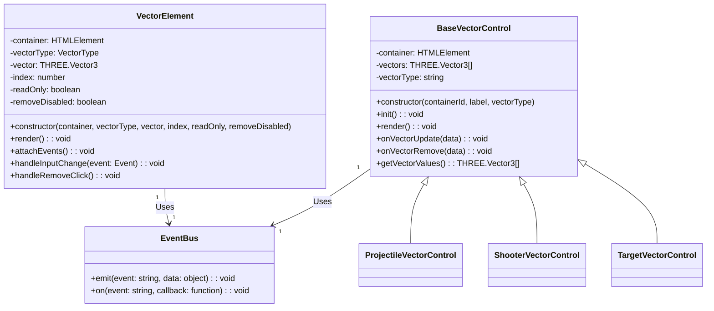
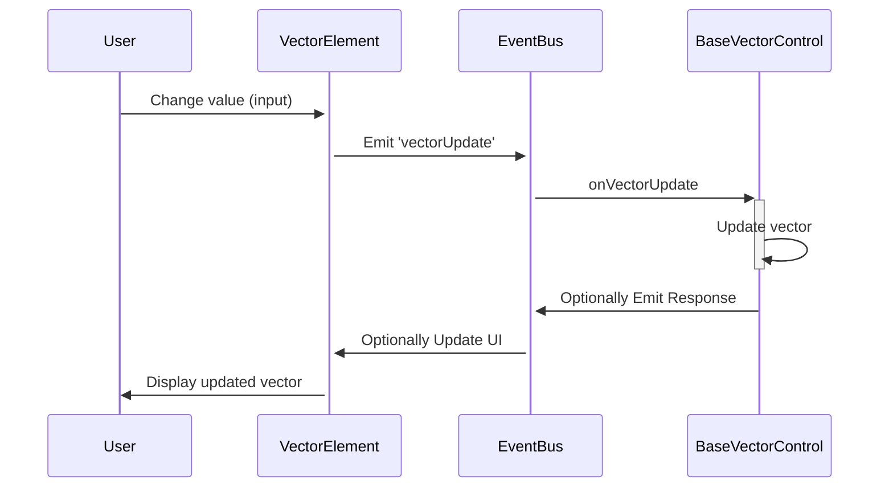

Creating a comprehensive set of diagrams for your project will help visualize the structure and interactions within your system. Since you're moving towards an ECS/event-driven architecture, I'll provide a basic outline using Mermaid diagrams, including a class diagram and a sequence diagram.

### Class Diagram
The class diagram will focus on the relationships between the main components:
- **VectorElement**: Responsible for rendering vector controls and firing events.
- **BaseVectorControl**: Abstract class for different vector types handling.
- **EventBus**: Manages the communication between components via events.

Here’s how you might represent these relationships:



### Sequence Diagram
A sequence diagram can illustrate how an update to a vector's component is handled through the system. This might involve a user interaction that triggers an event, which is then handled by the appropriate control class.



### Additional Diagrams
Depending on the complexity and specific functionalities of your project, you might also consider creating:
- **Component Diagrams**: Show how your application is split into components and how they interact.
- **Deployment Diagrams**: Useful if your system is distributed across multiple servers or services.

These diagrams provide a visual aid for understanding the architectural relationships and interactions within your system. As you develop further or make modifications, updating these diagrams will help maintain clarity about the system’s structure and behavior.

Certainly! A component diagram will help illustrate how your project is structured in terms of software components and their interactions. Given your move towards an ECS/event-driven architecture, the focus will be on showing how the major components such as the `VectorElement`, `BaseVectorControl` derivatives, and the `EventBus` are organized and interconnect.

### Component Diagram Description
Here's how you might describe the components in your project:

- **UI Components**: These are the front-end elements like `VectorElement` that users interact with. They generate events based on user actions.
- **Vector Controls**: These are the specialized controls for different vector types, derived from `BaseVectorControl`, such as `ProjectileVectorControl`, `ShooterVectorControl`, and `TargetVectorControl`.
- **EventBus**: Serves as the central hub for event management, distributing events to various listeners in the system.
- **HelpButton**: A component that provides contextual help. It's used within `VectorElement` to give users guidance based on vector type and other conditions.

### Mermaid Component Diagram
Here is how you can visualize these components and their interactions using a Mermaid diagram:

```mermaid
classDiagram
    class UIComponents {
        <<component>>
        VectorElement
    }

    class VectorControls {
        <<component>>
        BaseVectorControl
        ProjectileVectorControl
        ShooterVectorControl
        TargetVectorControl
    }

    class Utilities {
        <<component>>
        HelpButton
    }

    class EventBus {
        <<component>>
        +emit(event: string, data: object)
        +on(event: string, callback: function)
    }

    UIComponents -->> EventBus : Emits events
    EventBus -->> VectorControls : Dispatches events
    UIComponents -->> Utilities : Uses
    VectorControls ..> Utilities : Optional use

    note right of UIComponents : User Interfaces\nHandle input and visualize data
    note right of VectorControls : Manage vector data\nRespond to events
    note right of EventBus : Central event management\nFacilitates communication
    note right of Utilities : Supportive functionalities\nlike contextual help
```

### Explanation of the Diagram

- **UI Components** communicate with the **EventBus** by emitting events based on user interactions, such as updating or removing vectors.
- **EventBus** then dispatches these events to the **VectorControls**, which handle the specific logic related to different types of vectors.
- **Utilities** like the **HelpButton** are used within UI components to provide additional functionality. They might also be used within vector controls for specific operations or display purposes.
- Arrows indicate the flow of information and control, showing how components interact and rely on each other within the architecture.

This diagram provides a clear view of the modular structure of your application, illustrating the separation of concerns and the event-driven communication between components. As your application evolves, this diagram can be updated to reflect new components or changes in interactions.